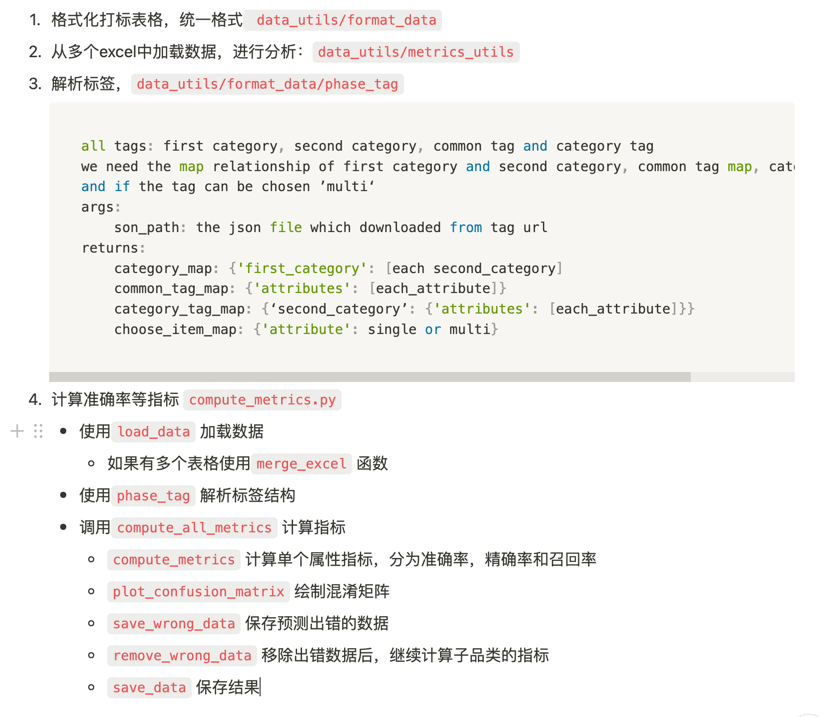

工作：


1. 格式化打标表格，统一格式 `data_utils/format_data`
2. 从多个excel中加载数据，进行分析：`data_utils/metrics_utils`
3. 解析标签，`data_utils/format_data/phase_tag`
    
    ```python
    """all tags: first category, second category, common tag and category tag
    we need the map relationship of first category and second category, common tag map, category tag map
    and if the tag can be chosen ’multi‘
    args:
        son_path: the json file which downloaded from tag url
    returns:
        category_map: {'first_category': [each second_category]
        common_tag_map: {'attributes': [each_attribute]}
        category_tag_map: {‘second_category’: {'attributes': [each_attribute]}}
        choose_item_map: {'attribute': single or multi}"""
    ```
    
4. 计算准确率等指标 `compute_metrics.py`
    - 使用`load_data` 加载数据
        - 如果有多个表格使用`merge_excel` 函数
    - 使用`phase_tag` 解析标签结构
    - 调用`compute_all_metrics` 计算指标
        - `compute_metrics` 计算单个属性指标，分为准确率，精确率和召回率
        - `plot_confusion_matrix` 绘制混淆矩阵
        - `save_wrong_data` 保存预测出错的数据
        - `remove_wrong_data` 移除出错数据后，继续计算子品类的指标
        - `save_data` 保存结果